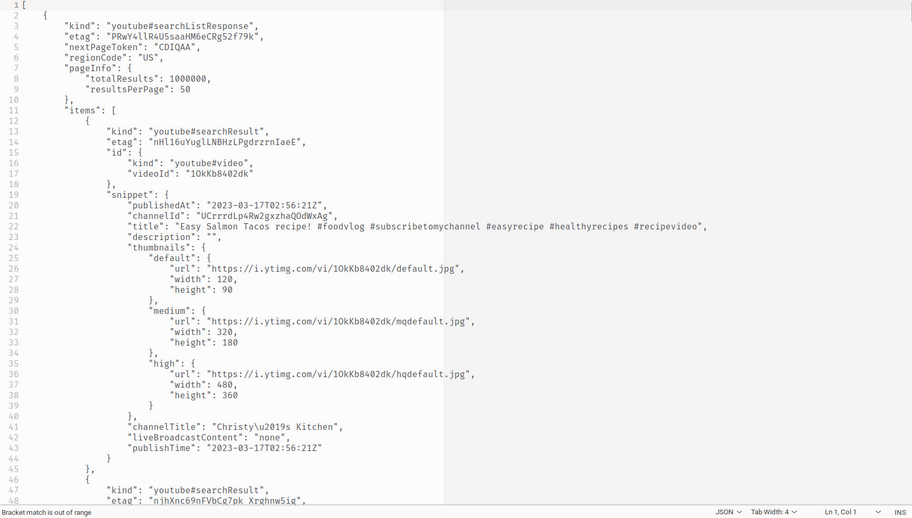

### About this tutorial

This tutorial provides a quick tour of `youte` and how you can use it to query basic data from YouTube. Familiarity with using the terminal is recommended, although we will try to cover enough of the basics of command-line interface and APIs for you to use `youte`.

## About `youte`

`youte` is a helper library that interacts with [YouTube Data API](https://developers.google.com/youtube/v3). Effectively, it makes working with YouTube API and collecting YouTube metadata and comments easy and intuitive. `youte` is primarily run as a command-line tool.

`youte` is currently actively developed and new capabilities are being added at the present. Keep an eye out for new releases on our [GitHub page](https://github.com/QUT-Digital-Observatory/youte).


### YouTube Data API

Under the hood, `youte` interacts with YouTube Data API, so a quick reminder of what an API is might be useful, although not critical for you to use `youte`. In short, an *Application Programming Interface* or *API* is a set of communication protocols that help two programs or applications talk to each other. According to this protocol, you send a request to the API, and the API returns a response code to tell you whether your request was valid, and a response body that contains the data requested.

As an API, [YouTube Data API](https://developers.google.com/youtube/v3/getting-started) allows you to get the information for a wide range of resources. A YouTube [*resource*](https://developers.google.com/youtube/v3/getting-started#resources) is an entity that makes up the YouTube experience, including video, channel, playlist, comment, and search results. Each resource has a unique ID given by YouTube. These IDs will come in handy when you query data from YouTube API.

The API also allows you to update, delete or create YouTube resources, although as a data collection tool, `youte` currently does not support these operations.

### Command-line

We mentioned that `youte` is a command-line tool. So what is a command line? A *command line*, or the *shell*, is an interface that takes textual, keyboard commands and passes them to your computer for execution.

A variety of shells are used across operating systems. Some common ones are listed below:

-   Windows: Command Prompt (cmd), Powershell, Git Bash, Windows Subsystem for Linux (WSL)

-   Linux & Mac OS: Bash, Zsh

Apart from the very basic, we will not cover in-depth shell commands in depth. If you need a quick introduction of how the shell works, [this guide](https://swcarpentry.github.io/shell-novice/) is a useful resource.

## Installing youte

In this tutorial, we'll be using the Bash shell. The Bash shell is already the default shell in Mac OS and Linux. Open the Terminal app in your Mac OS or Linux to get to the shell.

Windows users can install and use [Git Bash](https://gitforwindows.org/) or [Windows Subsystem for Linux](https://learn.microsoft.com/en-us/windows/wsl/install) to access the Bash shell.

Once your terminal is open, to install youte, run this command in your shell:

``` shell
python -m pip install youte
```

`youte` can work with Python 3.8 and above, so make sure you check your Python version before installing.

To check that you've installed youte successfully, run:

```shell
youte --version
```

If everything is installed properly, the command will print out the version number of youte.

### Issues installing `youte` in Anaconda

If you use Anaconda's distribution of Python, there might be issues installing and using `youte`. The below solutions have been tried and shown to work:

- If you install `youte` in the base environment (i.e. not in a virtual environment), run `youte` in Anaconda Prompt as opposed to other shells.

- You can install `youte` in a virtual environment and run it in that virtual environment. Refer to this [guide](https://python.land/virtual-environments/virtualenv) for a quick walk-through on how to create and activate a Python virtual environment.

## Set up

### YouTube API Key

To get started, you will need a YouTube API key. Obtaining an API key is simple and straightforward, but you will need a Google account to do so. Instructions for getting an API key are described [here](https://developers.google.com/youtube/v3/getting-started).

### Configure API key in youte

All `youte` commands that retrieve data from YouTube require you to input your API key each time you run them. Alternatively, you can store your API key in `youte`, so that you won't have to repeatedly specify an API key. You do so by entering this command in the shell:

``` shell
youte config add-key
```

The interactive prompt will ask you to enter your API key and give it a name. The name will be used to specify the API key, and it can be anything you choose. This will save you the trouble of having to enter the API key every time you query data from YouTube - all you need is the key's name.

You can also set a key as the default key. If there is a default key, it will be used automatically every time you run a query.

Behind the scenes, `config add-key` stores your API key in a config file which `youte` will refer to when running queries.

To see a list of all stored keys, run:

``` shell
youte config list-keys
```

To manually set a stored key as a default, run:

``` shell
youte config set-default <NAME-OF-KEY>
```

Here you specify the *name* of the API key you want to set as default.

To remove an API key from `youte`, run:

```shell
youte config remove <NAME-OF-KEY>
```

**Note.** In this tutorial, we won't explicitly specify an API key in any `youte` command, under the assumption that you have configured an API key and set it as default.

## Run a search

Now, onto the exciting part. Let's run a search!

Similarly to doing a YouTube search, `youte search` allows you to do get a list of videos matching keywords and other specified criteria. `youte` does not return audiovisual content, just the metadata such as video titles and descriptions.

Here is the format of `youte search` command.

``` shell
youte search <QUERY> -o <file-name>
```

Here you specify the query, as well as the file that raw output is to be stored into. The `-o` is a shorthand for `--outfile`, which you can use interchangeably. In this command, `QUERY` and `-o <file>` are the minimum requirements. If either or both is not specified, the command will not run. 

Let's do a search for videos on salmon recipes, and store in a file called salmon_search.json:

```shell
youte search "salmon recipes" -o salmon_search.json -m 2
```

Notice the quotes around "salmon recipes". Spacing is important in shell commands. Therefore, if there is any space in your search term, wrap everything inside quotes. 

The `-m` limits the number of pages returned to 2. You can omit this option if you want to retrieve all result pages.

YouTube API returns data as a bunch of **JSON**, the standard format for data exchange between systems or applications. Therefore, the file to store these data has to have `.json` ending. Here is a glimpse of the JSON output:


If this looks intimidating, don't worry. There are ways to handle JSON objects, and youte has built-in tools to format, tidy, and process these data.

For example, you can "prettify" the JSON output:

```shell
youte search "salmon recipes" -o salmon_search.json --pretty
```

The `--pretty` flag will break down the JSON into lines with proper indents, so that it's easier to view.



Now you can clearly see the different attributes and values, as well as some nested data within the raw JSON.

### Search options

Now, the search we just did is pretty broad. To get a more refined set of results, we might have to specify more than just the search term. What if you only want videos uploaded within a specific period? Or only videos longer than a certain duration? Or only videos that can be viewed in Australia?

`youte search` comes with many filters that YouTube Data API supports to refine your searches. For example, the `--from` and `--to` options restrict a search within a specified time frame. The `--video-duration` retrieves videos of a certain length. And `--region` gets you videos that can be viewed in a specified country.

Let's apply these in our command. You'll notice the back slash (`\`), which is just a way to enter a newline without breaking the command. This helps with readability.

``` shell
youte search "salmon recipes" \
    -o salmon_recipes_search.json \
    --from 2023-01-01 \
    --to 2023-01-31 \
    --video-duration long \
    --region au
```

Note that the dates for `--from` and `--to` have to be in YYYY-MM-DD format, otherwise you will get an error.

As we run this command, we'll get a more refined set of results.

Besides the above, there is a range of options that you can specify to further narrow your search. To get a full list of available options and what to use for each option, specify the flag `--help`.

``` shell
youte search --help
```

The `--help` flag shows the documentation for a command, so that's usually the first place to go to if you want to know how to use a command.

### Export to CSV

As you have seen above, raw output requires some processing before you can analyse it. `youte` does it for you to some extent. You can tidy the raw output into a cleaned CSV or a flat JSON object, using the option `--tidy-to <filename>`. For example:

``` shell
youte search "salmon recipes" \
    -o salmon_recipes_search.json \
    --from 2023-01-01 \
    --to 2023-01-31 \
    --video-duration long \
    --region au \
    --tidy-to salmon_search.csv
```

This will tidy and export the search data into a CSV, which you can readily import to most analysis software such as Tableau, Excel, NVivo, R, or Python.

## Retrieve data about videos or channels

### Videos

Now, if you look at the search results returned from `youte search`, you'll see that they contain only a few fields of information. For example, video statistics are not provided, and video descriptions are truncated.

`youte search` only returns some data. Thus, if you want to get full data on a set of videos or channels you will to use `youte videos`.

`youte videos` command takes as input a list of video IDs and retrieves information for those. Each YouTube resource (video, channel, comment) is assigned a unique identifier. You can get the ID of a video in the URL or within the data returned by YouTube Data API. For example, the ID of a YouTube video can be found in the video's URL:

https://www.youtube.com/watch?v=**5MXTcO1veRQ**

Now, let's retrieve the metadata for this video:

``` shell
youte videos 5MXTcO1veRQ -o video.json
```

You can also hydrate multiple videos. Make sure you separate each id with a space.

``` shell
youte videos 5MXTcO1veRQ cbAj3biUeDI dTI3I9ZFzTI -o videos.json
```

You can specify as many video ids as you want in the shell, but of course things get messy when you have too many ids. If you have a long list of IDs, you can put them all in text file, each ID on a new line, and instruct `youte videos` to use that file by specifying the `-f` flag.

``` shell
youte videos -f video_ids.txt -o videos.json
```

Similar with `youte search`, you can take advantage of `--tidy-to` to tidy raw data into a CSV.

``` shell
youte videos -f video_ids.txt -o videos.json --tidy-to videos.csv
```

### Channels

If you want to get metadata for a list of channel IDs, use `youte channels`.

``` shell
youte channels UC3mORGO2XYSn3Y_BUPuazeQ -o one_channel.json
youte channels UCC-jcZTFL1r17E-bEC7VYYA UC3mORGO2XYSn3Y_BUPuazeQ -o channels.json
```

#### Working with channel IDs

Similar to video IDs, channel IDs can be found in the channels' URLs (https://www.youtube.com/channel/**UC3mORGO2XYSn3Y_BUPuazeQ**).

However, most often channel IDs will be more difficult to find because YouTube channels can have custom names and URLs (e.g. https://www.youtube.com/c/**AmbitionMusic**), and older channels might have a different URL (e.g. https://www.youtube.com/user/QueenAnime141).

Therefore, the best way to get channel IDs is in the output from `youte search` or `youte videos`.

### Extract ids from YouTube API data

Often, a common workflow goes like so: do a youte search of relevant videos, then retrieve the full data on those videos, instead of copying and pasting video IDs from the URLs. `youte dehydrate` provides a quick way to extract the IDs from the JSON resulted by `youte search`, and store them in a text file.

Say you have done a youte search for "salmon recipes" and stored the JSON result in `salmon_recipes_search.json`. Let's get the IDs of all videos within that data, and store it in a file `salmon_ids.csv`.

```shell
youte dehydrate salmon_recipes_search.json -o salmon_ids.csv
```

Now you can use `videos -f` to retrieve the full data for those videos.

```shell
youte videos -f salmon_ids.csv -o salmon_videos.json
```

`dehydrate` is also useful for when you want to publish or share data, i.e. as a list of IDs which others can easily retrieve metadata for.


## Get comments

If you're interested in the conversation going in the comments section, `youte comments` retrieves the comment threads (top level comments) for a video or a channel.

`youte comments` works similarly to `youte videos` in that it takes one or many video IDs or thread IDs, which can be input straight to the shell, or stored in a text file and referred to with the `-f` flag. The main difference is that you have to specify a flag to indicate which type of resource the specified IDs are.

If the IDs are video IDs, pass the `-v` flag to indicate so.

``` shell
youte comments -v 5MXTcO1veRQ cbAj3biUeDI dTI3I9ZFzTI -o comment_threads.json
```

One potential issue you might run into when running this command is if the video has comments disabled. In this case, the program will show a warning and skip to other IDs if there is any.

### Get replies to comments

To get the replies to the comment threads, use `youte replies`. `youte replies` takes a list of comment thread IDs and return the replies to those threads, if there is any. In a browser, the thread ID can be seen if you hover your mouse over a comment's timestamp. Or you can get the thread IDs from the data returned by `comments`.

https://www.youtube.com/watch?v=A-mO7rbYtgk&lc=**UgwTqVJTgz1gZl6X57Z4AaABAg**

``` shell
youte replies UgwTqVJTgz1gZl6X57Z4AaABAg -o replies.json
```

This command will return an empty JSON if there are no replies.