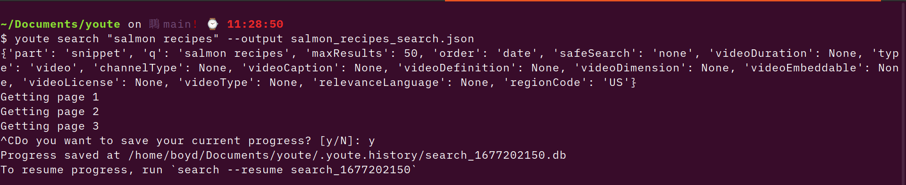

### About this tutorial

This tutorial provides a quick tour of `youte` and how you can use it to query basic data from YouTube. Familiarity with using the terminal is recommended, although we will try to cover enough of the basics of command-line interface and APIs for you to use `youte`.

## About `youte`

`youte` is a helper library that interacts with [YouTube Data API](https://developers.google.com/youtube/v3). Effectively, it makes working with YouTube API and collecting YouTube metadata and comments easy and intuitive. `youte` is primarily run as a command-line tool.

`youte` is currently actively developed and new capabilities are being added at the present. Keep an eye out for new releases on our [GitHub page](https://github.com/QUT-Digital-Observatory/youte).


### YouTube Data API

As under the hood, `youte` interacts with YouTube Data API, a quick reminder of what an API is might be useful, although not critical for you to use `youte`. In short, an *Application Programming Interface* or *API* is a set of communication protocols that help two programs or applications talk to each other. According to this protocol, you send a request to the API, and the API returns a response code to tell you whether your request was valid, and a response body that contains the data requested.

As an API, [YouTube Data API](https://developers.google.com/youtube/v3/getting-started) allows you to get the information for a wide range of resources. A YouTube [*resource*](https://developers.google.com/youtube/v3/getting-started#resources) is an entity that makes up the YouTube experience, including video, channel, playlist, comment, and search results. Each resource has a unique ID given by YouTube. These IDs will come in handy when you query data from YouTube API.

The API also allows you to update, delete or create YouTube resources, although as a data collection tool, `youte` currently does not support these operations.

### Command-line

We mentioned that `youte` is a command-line tool. So what is a command line? A *command line*, or the *shell*, is an interface that takes textual, keyboard commands and passes them to your computer for execution.

A variety of shells are used across operating systems. Some common ones are listed below:

-   Windows: Command Prompt (cmd), Powershell, Git Bash

-   Linux & Mac OS: Bash, Zsh

Apart from the very basic, We do not go in-depth on shell commands and how to use the shell in this tutorial. If you need a quick introduction of how the shell works, [this guide](https://swcarpentry.github.io/shell-novice/) is a useful resource.

## Installing youte

In this tutorial, we'll be using the Bash shell. The Bash shell is already the default shell in Mac OS and Linux. Open the Terminal app in your Mac OS or Linux to get to the shell.

Windows users can install and use [Git Bash](https://gitforwindows.org/) or [Windows Subsystem for Linux](https://learn.microsoft.com/en-us/windows/wsl/install) to access the Bash shell.

Once your terminal is open, to install youte, run this command in your shell:

``` shell
python -m pip install youte
```

`youte` can work with Python 3.8 and above, so make sure you check your Python version before installing.

To check that you've installed youte successfully, run:

```shell
youte --version
```

If everything is installed properly, the command will print out the version number of youte.

### Issues installing `youte` in Anaconda

If you use Anaconda's distribution of Python, there might be issues installing and using `youte`. The below solutions have been tried and shown to work:

- If you install `youte` in the base environment (i.e. not in a virtual environment), run `youte` in Anaconda Prompt as opposed to other shells.

- You can install `youte` in a virtual environment and run it in that virtual environment. Refer to this [guide](https://python.land/virtual-environments/virtualenv) for a quick walk-through on how to create and activate a Python virtual environment.

## Set up

### YouTube API Key

To get started, you will need a YouTube API key. Obtaining an API key is simple and straightforward, but you will need a Google account to do so. Instructions for getting an API key are described [here](https://developers.google.com/youtube/v3/getting-started).

### Configure API key in youte

All `youte` commands that retrieve data from YouTube require you to input your API key each time you run them. Alternatively, you can store your API key in `youte`, so that you won't have to repeatedly specify an API key. You do so by entering this command in the shell:

``` shell
youte config add-key
```

The interactive prompt will ask you to enter your API key and give it a name. The name will be used to specify the API key, and it can be anything you choose. This will save you the trouble of having to enter the API key every time you query data from YouTube - all you need is the key's name.

You can also set a key as the default key. If there is a default key, it will be used automatically every time you run a query.

Behind the scenes, `config add-key` stores your API key in a config file which `youte` will refer to when running queries.

To see a list of all stored keys, run:

``` shell
youte config list-keys
```

To manually set a stored key as a default, run:

``` shell
youte config set-default <NAME-OF-KEY>
```

Here you specify the *name* of the API key you want to set as default.

To remove an API key from `youte`, run:

```shell
youte config remove <NAME-OF-KEY>
```

**Note.** In this tutorial, we won't explicitly specify a API key in any youte command under the assumption that you have configured an API key and set it as default.

## Run a search

Now, onto the exciting part. Let's run a search!

Similarly to doing a YouTube search, `youte search` allows you to do get a list of videos matching keywords and other specified criteria. `youte` does not return audiovisual content, just the metadata such as video titles and descriptions.

Here is the format of `youte search` command.
``` shell
youte search <QUERY>
```

Let's do a search for videos on salmon recipes:

```shell
youte search "salmon recipes"
```

Notice the quotes around "salmon recipes". Spacing is important in shell commands. Therefore, if there is any space in your search term, wrap everything inside quotes.

The results of this command will be printed to the terminal. You'll observe that the results are very difficult to see.


This is because YouTube API returns data as a bunch of **JSON**, the standard format for data exchange between systems or applications. While the JSON contains a lot of useful information, in this format it is impossible to analyse and interpret.

Instead, we can store the JSON in a file, to easily process it later using JSON-processing tools.

``` shell
youte search "salmon recipes" --output salmon_recipes_search.json
```

By specify the name of the file ("salmon_recipes_search.json") after the `--output` flag, you instruct `youte` to store the results in that file, rather than print them out on the shell. The file has to have a `.json` ending.

### Search options

Now, that search is pretty broad. What if you only want videos uploaded within a specific period? The `--from` and `--to` options let you specify the time videos are published. Let's specify that we only want salmon recipes videos uploaded within the last month.

Note that shell commands have to be typed in one line. The backlashes (\\) are used to enter a new line without breaking the command and help with readability.

``` shell
youte search "salmon recipes" salmon_recipes_search.json \
    --from 2023-01-01 \
    --to 2023-01-31
```

The date has to be in YYYY-MM-DD format, otherwise you will get an error.

Let's refine our search a bit further. Let's search for short videos that are under 4 minutes.

``` shell
youte search "salmon recipes" salmon_recipes_search.json \
    --from 2023-01-01 \
    --to 2023-01-31 \
    --video-duration short
```

Besides the above, there is a range of options that you can specify to further narrow your search. To get a full list of available options, specify the flag `--help`.

``` shell
youte search --help
```

The `--help` flag shows the documentation for a command, so that's usually the first place to go to if you want to know how to use a command.

### Save search progress

Often there is a limit to how much data you get from YouTube API per day. Searching, in particular, is very "expensive" in terms of API usage. Therefore, you can choose to save the progress of a search so that if you exit the program prematurely, either by accident or on purpose, you can resume the search to avoid wasting valuable quota units.

Specifically, when you exit the program in the middle of a search, a prompt will ask if you want to save its progress. If yes, progress of the search is saved in a database, whose ID is displayed in the shell along with instructions on how to resume progress from this database.



To resume progress from a database, add the `--resume` flag followed by the search ID.

``` shell
youte search "salmon recipes" salmon_recipes_search.json \
    --from 2023-01-01 \
    --to 2023-01-31 \
    --video-duration short \
    --resume search_1675381044
```

The progress file is automatically deleted once youte has completed collecting all data for a search.

### Export to CSV

Another useful feature in youte is processing your results into a tidy CSV. To do so, specify the tag `--to-csv` followed by the name of the CSV file.

``` shell
youte search "salmon recipes" salmon_recipes_search.json \
    --from 2023-01-01 \
    --to 2023-01-31 \
    --video-duration short \
    --resume search_1675381044 \
    --to-csv salmon_recipes_search.csv
```

Now you have the raw JSON file, as well as a tidy CSV file which can then be easily plugged into analysis software.

## Retrieve data about videos or channels

### Videos

Now, if you look at the search results returned from `youte search`, you'll see that they contain only a few fields of information. For example, video statistics are not provided, and video descriptions are truncated.

`youte search` only returns some data. Thus, if you want to get full data on a set of videos or channels you will need to use `hydrate`. *Hydrating* is a concept taken from Twitter API, which means retrieving the data about videos or channels using their IDs.

`youte hydrate` command takes as input a list of video or channel IDs and retrieves information on those. Each YouTube resource (video, channel, comment) is assigned a unique identifier. You can get the ID of a video in the URL or within the data returned by YouTube Data API. For example, the ID of a YouTube video can be found in the video's URL:

https://www.youtube.com/watch?v=**5MXTcO1veRQ**

Now let's hydrate this video. By default, `youte hydrate` takes the IDs as video IDs and return video information. So you can hydrate one video easily with:

``` shell
youte hydrate 5MXTcO1veRQ
```

You can also hydrate multiple videos and store results in a file:

``` shell
youte hydrate 5MXTcO1veRQ cbAj3biUeDI dTI3I9ZFzTI videos.json
```

If you have a long list of IDs, you can put them all in text file, each ID on a new line, and instruct `youte hydrate` to use that file by specifying the `-f` flag.

``` shell
youte hydrate -f video_ids.txt videos.json
```

### Channels

If you want to hydrate a list of channel IDs, pass the `--channel` flag.

Hydrate 1 channel ID:

``` shell
youte hydrate --channel UC3mORGO2XYSn3Y_BUPuazeQ
```

Hydrate multiple channel IDs:

```shell
youte hydrate --channel UCC-jcZTFL1r17E-bEC7VYYA UC3mORGO2XYSn3Y_BUPuazeQ
```

#### Working with channel IDs

Similar to video IDs, channel IDs can be found in the channels' URLs (https://www.youtube.com/channel/**UC3mORGO2XYSn3Y_BUPuazeQ**).

However, most often channel IDs will be more difficult to find because YouTube channels can have custom names and URLs (e.g. https://www.youtube.com/c/**AmbitionMusic**), or older channels might have a different URL (e.g. https://www.youtube.com/user/QueenAnime141). These custom names won't be able to hydrate.

Therefore, the best way to get channel IDs is in the search results from `youte search`.

### Extract IDs from youte data

More often, you want to do a youte search of relevant videos, then retrieve the full data on those videos, instead of copying and pasting video IDs from the URLs. `youte dehydrate` provides a quick way to extract the IDs from the JSON resulted by youte search, and store them in a text file.

Say you have done a youte search for "salmon recipes" and stored the JSON result in `salmon_recipes_search.json`. Let's get the IDs of all videos within that data, and store it in a file `salmon_ids.csv`.

```shell
youte dehydrate salmon_recipes_search.json --output salmon_ids.csv
```

Now you can use `hydrate -f` to retrieve the full data for those videos.

```shell
youte hydrate -f salmon_ids.csv salmon_videos.json
```

`dehydrate` is also useful for when you want to publish or share data, i.e. as a list of IDs which others can easily hydrate.


## Get comments

If you're interested in the conversation going in the comment section, `youte get-comments` retrieves the comment threads (top level comments) under a video or a list of videos. `youte get-comments` can also retrieve replies to those comment threads using the thread IDs.

`get-comments` works similarly to `hydrate` in that it takes one or many video IDs or thread IDs, which can be input straight to the shell, or stored in a text file and referred to with the `-f` flag. The major difference is that you have to specify a flag to indicate whether IDs belong to videos or threads.

If the IDs are video IDs, pass the `-v` flag to indicate so.

``` shell
youte get-comments -v 5MXTcO1veRQ cbAj3biUeDI dTI3I9ZFzTI
```

One potential issue you might run into when running this command is if the video has comments disabled. In this case, the program will show a warning and skip to other IDs if there is any.

You can get the replies to a thread by running `get-comments` with the thread ID and passing `-t` to indicate the ID belongs to a thread, not a video.

In a browser, the thread ID can be seen if you hover your mouse over a comment's timestamp. Or you can get the thread IDs from the data returned by `get-comments`.

https://www.youtube.com/watch?v=A-mO7rbYtgk&lc=**UgwTqVJTgz1gZl6X57Z4AaABAg**

``` shell
youte get-comments -t UgwTqVJTgz1gZl6X57Z4AaABAg
```

This command will return an empty JSON if there are no replies.

## Tidy data into a relational database

### JSON format

All data returned from `youte search`, `youte hydrate`, and `youte get-comments` are in JSON format.

*What is JSON?*

[JSON](https://www.w3schools.com/js/js_json_intro.asp) is the most common way for exchanging text data. Today it is the universal standard of data exchange because of its conciseness, versatility, and platform independence.

Here is an example of a JSON object.

``` {.json .no-copy}
{
  "kind": "youtube#searchResult",
  "etag": "B_TxCObncAju-vhnFwKefxRoNRI",
  "id": {
    "kind": "youtube#video",
    "videoId": "SR2Mf27YweM"
  },
  "snippet": {
    "publishedAt": "2022-08-31T00:43:25Z",
    "channelId": "UCnSc_XzYmAMMSJX4shj7ovw",
    "title": "30/08/22 :: 9 HOURS STUDY WITH ME [PART-2/2] :: CA: UPSC: PCS: IIT: NEET: SSC: OTHER EXAMS",
    "description": "Why is this channel ? As we know that to get good marks in any exam ,we have to study hard and for which consistency is ...",
    "thumbnails": {
      "default": {
        "url": "https://i.ytimg.com/vi/SR2Mf27YweM/default.jpg",
        "width": 120,
        "height": 90
      },
      "medium": {
        "url": "https://i.ytimg.com/vi/SR2Mf27YweM/mqdefault.jpg",
        "width": 320,
        "height": 180
      },
      "high": {
        "url": "https://i.ytimg.com/vi/SR2Mf27YweM/hqdefault.jpg",
        "width": 480,
        "height": 360
      }
    },
    "channelTitle": "BE CONSISTENT",
    "liveBroadcastContent": "none",
    "publishTime": "2022-08-31T00:43:25Z"
  }
}
```

Everything inside a curly braces belongs to an object. An *object* is basically a thing or an entity. Within that object, you can have object properties or attributes, represented by key-value pairs. As shown in the example above, you can also have objects nested within objects.

As you can see, the JSON format is great for data exchange, but not for data analysis, for which you'll probably need something closer to a table or spreadsheet. This is where `youte tidy` might come in handy, as it processes and transforms raw JSON files into a relational, SQLite database.

### Relational database

A relational database contains tables of columns and rows. Each row represents an entity (object) and each column an attribute of that entity. So it looks very similar to your spreadsheet or CSV file. While you can export YouTube data to CSV format using `--to-csv` in most youte commands, there are cases where a relational database is more desirable. Relational databases are excellent in checking data redundancy and joining data. For example, you can have a `videos` table, a `channels` table, a `comments` table and combine them in multiple ways to get a fuller picture of the dataset.

SQLite is a light-weight database engine that stores an entire database within a `.db` file, making it easy to transfer and work with small-scale databases. Interacting with databases requires [SQL](https://www.w3schools.com/sql/sql_intro.asp), although there are tools and libraries that will minimise the amount of SQL you'll need to read data.


Now, let's see what `youte tidy` does. It takes in one or multiple JSON files as input, and a `.db` file as output.

``` shell
youte tidy <INPUT-JSON>... <OUTPUT-DB>
```

Each JSON file should contain ***one*** type of resource (e.g. search result, video, channel, comment). And the output file must have a `.db` ending. Let's tidy our salmon videos JSON to a database.

``` shell
youte tidy salmon_videos.json salmon.db
```

### Working with databases in R and Python

Once your data is in a database, with a bit of programming knowledge you can extract and combine them in ways most suitable for your analysis. Below are some tools that you can use to work with SQlite files, in R and Python - the two common languages for data analysis.

#### R

In R, the `RSQLite` package offers a nice and easy way to interact and read data from `.db` files.

``` r linenums="1" title="analysis.R"
library(DBI)     # for createing database connection
library(RSQLite)

con <- DBI::dbConnect(RSQLite::SQLite(), "salmon.db")
dbListTables(con)             # list all tables in the database
data <- dbReadTable(con, "videos")  # get table `comments` to a dataframe
```

#### Python

The `pandas` library offers some nice functions to connect with and read data from databases. pandas' `read_sql_query` lets you query a database into a DataFrame.

``` python linenums="1" title="analysis.py"
import pandas
import sqlite3   # for creating connection with SQLite databases

# connect to cleaned.db
con = sqlite3.connect("salmon.db")

# read all data from table "comments" to a pandas DataFrame
data = pandas.read_sql_query("SELECT * FROM comments", con=con)
```
